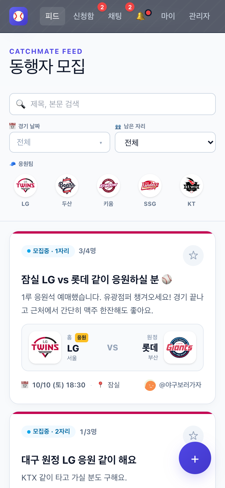
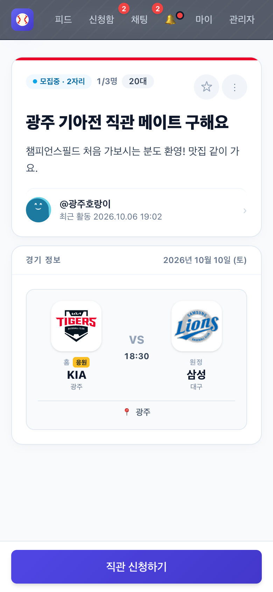
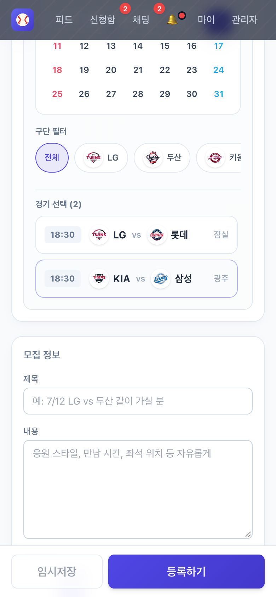
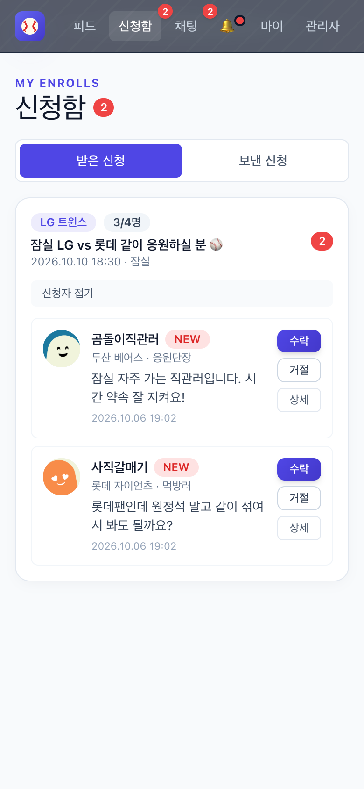
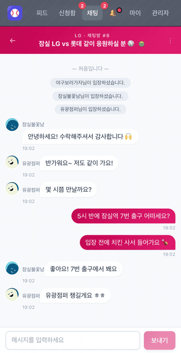
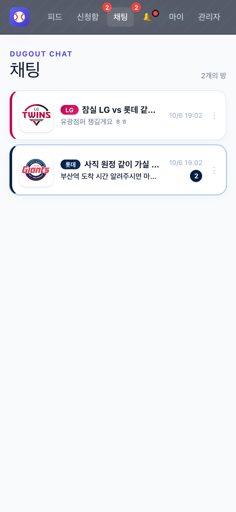
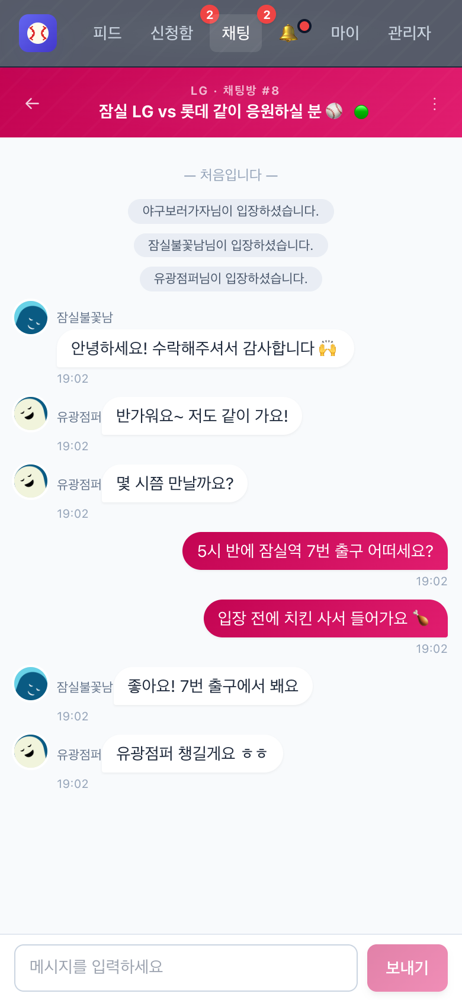
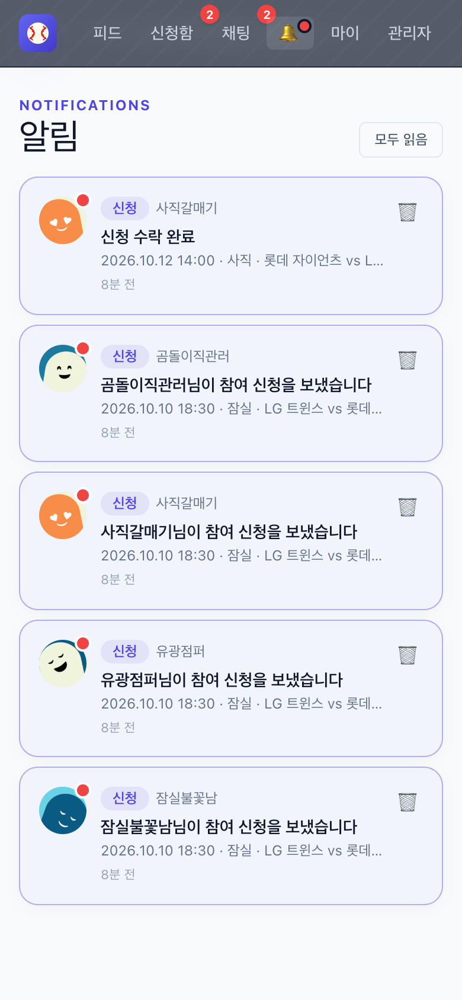
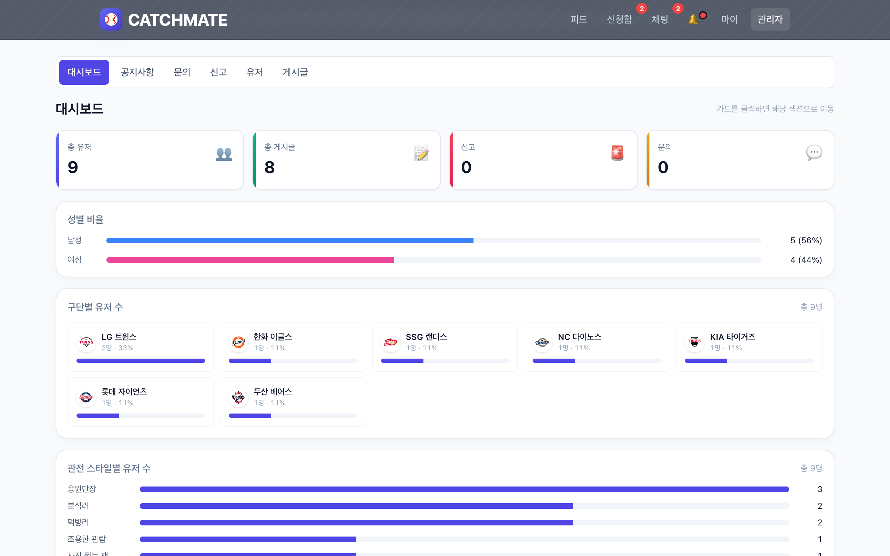
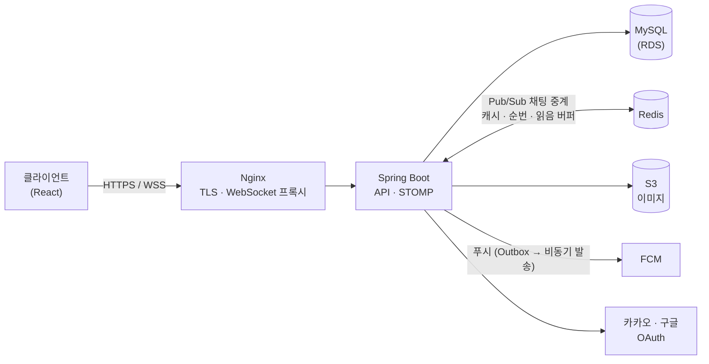

# CatchMate

**야구 직관 동행 매칭 서비스** — 같은 경기를 보러 갈 사람을 찾고, 신청·수락을 거쳐 채팅방에서 만납니다.

이 저장소는 CatchMate의 백엔드입니다. 프론트엔드(React + Vite)는 별도 저장소에서 관리합니다.

<br>

## 주요 기능

### 1. 동행 찾기 — 모집글 작성부터 수락까지

| 피드 | 모집글 상세 | 모집글 작성 | 받은 신청 관리 |
|:---:|:---:|:---:|:---:|
|  |  |  |  |

- **피드** — 경기 날짜·남은 자리·응원팀으로 필터링하고, 커서 기반 무한 스크롤로 불러옵니다. 작성자는 글을 피드 맨 위로 끌어올릴 수 있습니다.
- **모집글 작성** — 날짜를 고르면 그날의 KBO 경기 목록이 나오고, 경기·인원·선호 성별·연령대를 정해 글을 올립니다. 임시저장을 지원합니다.
- **신청·수락** — 신청이 들어오면 작성자가 수락하거나 거절합니다. 수락하면 신청자가 그 모집글의 채팅방에 자동으로 들어갑니다.
  - 마지막 남은 자리에 수락이 동시에 몰려도 정원을 넘지 않도록 낙관적 락(`@Version`)과 재시도(`@Retryable`)로 제어합니다.
  - 수락에 따른 인원 변경·채팅방 입장·알림은 신청 도메인이 직접 호출하지 않고 도메인 이벤트로 전달합니다.

### 2. 실시간 채팅

| 실시간 수신 | 채팅 목록 | 채팅방 |
|:---:|:---:|:---:|
|  |  |  |

- **STOMP over WebSocket**으로 메시지를 주고받습니다. 서버가 여러 대일 때는 **Redis Pub/Sub**로 메시지를 다른 인스턴스에 중계해, 어느 서버에 붙어 있든 같은 방의 메시지를 받습니다.
- 방마다 메시지 순번을 Redis에서 발급하고, 재접속하면 마지막으로 받은 순번 이후의 메시지를 다시 받아 빠진 메시지를 채웁니다.
- 읽음 위치는 매번 DB에 쓰지 않고 Redis에 모았다가 주기적으로 반영(write-behind)해 DB 쓰기 부하를 줄였습니다.
- 방장의 멤버 강퇴, 방별 알림 켜기·끄기를 지원합니다. 차단한 사용자와의 방은 읽기 전용이 됩니다.

### 3. 알림



- 신청·수락·거절·채팅·공지·문의 답변이 생기면 앱 안 실시간 알림(STOMP)과 FCM 푸시를 보냅니다.
- 알림은 비즈니스 트랜잭션과 같은 커밋으로 **Outbox 테이블에 먼저 저장**하고, 커밋이 끝난 뒤 비동기로 발송합니다. 그래서 푸시 서버가 느리거나 실패해도 신청·수락 요청은 기다리지 않습니다. 실패한 건은 스케줄러가 다시 보냅니다.
- 사용자는 알림 종류별로 수신 여부를 설정할 수 있습니다.

### 4. 관리자



- 사용자 수, 성별·구단·관전 스타일 분포를 보여주는 대시보드
- 공지 작성(전체 사용자에게 푸시 발송), 신고 처리, 1:1 문의 답변, 사용자·게시글 조회

<br>

## 기술 스택

| 분류 | 사용 기술 |
|---|---|
| Language · Framework | Java 21, Spring Boot 3.4, Spring Security, Spring Data JPA, QueryDSL |
| Database · Cache | MySQL 8, Redis (Pub/Sub, 캐시, 순번 발급, write-behind 버퍼, 토큰 저장소) |
| 실시간 · 푸시 | WebSocket (STOMP), Firebase Cloud Messaging |
| 인증 | OAuth 2.0 (카카오·구글), JWT (Access + Refresh) |
| 인프라 | AWS (RDS, S3), Nginx, Docker |
| 테스트 · 품질 | JUnit 5, Testcontainers, ArchUnit, Spotless, k6 (부하 테스트) |

<br>

## 시스템 구성



- 채팅 메시지는 저장 트랜잭션이 커밋된 뒤 Redis 채널로 발행되고, 각 인스턴스가 이를 구독해 자기에게 연결된 사용자에게 전달합니다. 그래서 앱 인스턴스를 늘려도 채팅이 끊기지 않습니다.
- 알림은 `@TransactionalEventListener`로 커밋 전에 Outbox에 기록하고, 커밋 후 별도 스레드에서 FCM으로 보냅니다.

<br>

## 패키지 구조

도메인 단위로 패키지를 나눈 **DDD 4계층** 구조입니다. 최상위 패키지 하나가 하나의 바운디드 컨텍스트(BC)입니다.

```
com.back.catchmate
├── board         모집글 · 피드 · 끌어올리기
├── enroll        동행 신청 · 수락 · 거절
├── chat          채팅방 · 메시지 · 읽음 처리
├── notification  알림 · Outbox · FCM 발송
├── user          회원 · 프로필 · 차단
├── auth          OAuth 로그인 · JWT
├── game / club   경기 일정 · 구단
├── bookmark      찜
├── notice        공지
├── inquiry       1:1 문의
├── report        신고
├── admin         관리자 대시보드
└── global        설정 · 공통 응답/에러 · 보안
```

각 BC는 같은 4계층으로 이루어집니다.

```
{bc}/
├── presentation    Controller, Request DTO
├── application     유스케이스 흐름, 트랜잭션, 타 BC 조회용 QueryApi, 이벤트 리스너
├── domain          엔티티와 비즈니스 규칙, Repository 인터페이스, 도메인 이벤트, 예외
└── infrastructure  Repository 구현(JPA · QueryDSL), Redis, 외부 API 연동
```

- 의존 방향은 `Presentation → Application → Domain ← Infrastructure` 입니다.
- 다른 BC의 엔티티는 ID로만 참조하고, 조회는 그 BC가 공개한 `QueryApi`로만 합니다. 다른 BC의 상태를 바꿀 때는 직접 호출하지 않고 도메인 이벤트를 발행합니다.
- 이 규칙들은 **ArchUnit 테스트**로 검사해, 위반하면 빌드가 실패합니다.
