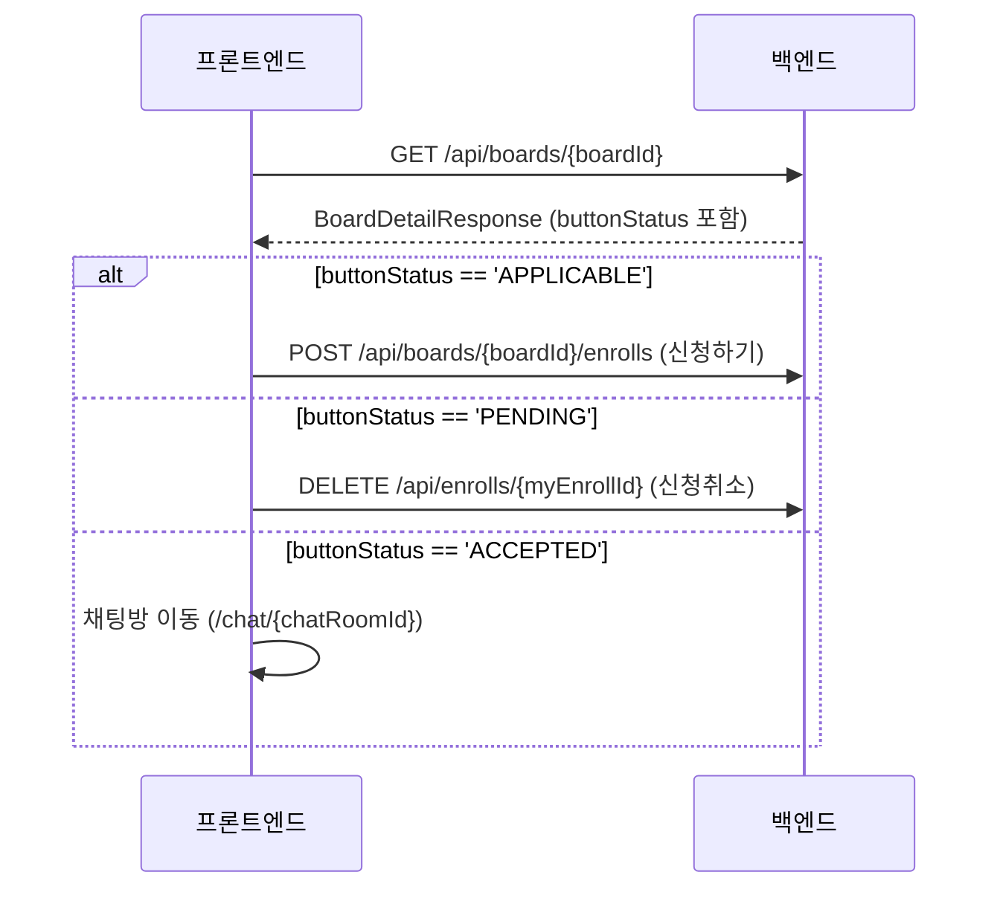
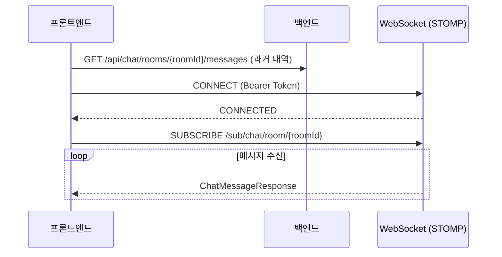

# CatchMate Frontend API Integration Guide

이 문서는 CatchMate 프론트엔드 개발자가 백엔드 API를 연동하기 위해 필요한 모든 정보를 담고 있습니다. 별도의 질문 없이 이 문서만으로 연동이 가능하도록 상세하게 작성되었습니다.

---

## 1. 프로젝트 개요

*   **서비스 설명**: 야구 직관 메이트 찾기 서비스
*   **API Base URL**: `https://api.catchmate.co.kr` (운영) / `http://localhost:8080` (로컬)
*   **공통 Path**: `/api`
*   **인증 방식**: JWT (AccessToken: Header, RefreshToken: HttpOnly Cookie)

---

## 2. 인증 (Auth)

CatchMate는 OAuth 2.0 기반의 소셜 로그인을 사용합니다.

### 2.1 OAuth 로그인 흐름

1.  **로그인 시작**: `GET /api/oauth/authorize/{provider}` 호출 (provider: `kakao`, `naver`, `google` 등)
    *   백엔드에서 해당 공급자의 인증 페이지로 리다이렉트합니다.
2.  **콜백 처리**: 인증 완료 후 백엔드 콜백 API(`/api/oauth/callback/{provider}`)가 호출됩니다.
3.  **결과 전달**:
    *   **기존 유저**: 프론트엔드 Success URL로 리다이렉트하며 쿼리 파라미터로 `access_token`을 전달합니다. `refresh_token`은 쿠키에 저장됩니다.
        *   예: `https://catchmate.co.kr/login/success?access_token=...`
    *   **신규 유저**: 프론트엔드 Signup URL로 리다이렉트하며 쿼리 파라미터로 `signup_token`을 전달합니다.
        *   예: `https://catchmate.co.kr/signup?signup_token=...`

### 2.2 회원가입 완료

*   **Endpoint**: `POST /api/oauth/signup`
*   **Request Body**:
    ```json
    {
      "signupToken": "string",
      "gender": "M", // 'M' or 'F'
      "nickName": "닉네임",
      "birthDate": "1995-01-01",
      "favoriteClubId": 1,
      "watchStyle": "응원형"
    }
    ```
*   **Response**: `SignUpResponse` (AccessToken 포함)

### 2.3 토큰 관리 (Auth)

| 기능 | Method | URL | 인증 | 비고 |
| :--- | :--- | :--- | :--- | :--- |
| 토큰 재발급 | POST | `/api/auth/reissue` | X | Cookie(`refresh_token`) 사용 |
| 로그아웃 | POST | `/api/auth/logout` | O | 쿠키 제거 및 토큰 무효화 |

---

## 3. 공통 규칙

### 3.1 Request

*   **Content-Type**: `application/json` (이미지 업로드 시 `multipart/form-data`)
*   **Authorization**: `Bearer {AccessToken}`

### 3.2 Response

#### 성공 응답 (일반)
별도의 래퍼 없이 데이터가 직접 반환됩니다.

#### 실패 응답
```json
{
  "timestamp": "2024-03-21T10:00:00",
  "status": 404,
  "error": "NOT_FOUND",
  "code": "USER_NOT_FOUND",
  "message": "존재하지 않는 사용자입니다."
}
```

### 3.3 주요 에러 코드
| 코드 | 상태 | 설명 |
| :--- | :--- | :--- |
| `INVALID_ACCESS_TOKEN` | 401 | 유효하지 않거나 만료된 Access Token |
| `FORBIDDEN_ACCESS` | 403 | 권한 없음 |
| `BOARD_NOT_FOUND` | 404 | 존재하지 않는 게시글 |
| `FULL_PERSON` | 400 | 모집 인원 마감 |
| `ALREADY_ENROLL_PENDING` | 400 | 이미 신청 대기 중 |

---

## 4. 도메인별 API

### 4.1 User (사용자)

| 기능 | Method | URL | 인증 | 비고 |
| :--- | :--- | :--- | :--- | :--- |
| 내 정보 조회 | GET | `/api/users/profile` | O | 마이페이지 |
| 타인 정보 조회 | GET | `/api/users/profile/{userId}` | O | 유저 프로필 팝업 |
| 닉네임 중복 체크 | GET | `/api/users/check-nickname` | X | `?nickName=...` |
| 프로필 수정 | PATCH | `/api/users/profile` | O | multipart (request, profileImage) |
| 알림 설정 조회 | GET | `/api/users/alarm` | O | 설정 페이지 |
| 알림 설정 변경 | PATCH | `/api/users/alarm` | O | `?alarmType=...&isEnabled=...` |
| FCM 토큰 등록 | PUT | `/api/users/me/fcm-token` | O | 푸시 알림용 |

### 4.2 Board (게시글)

| 기능 | Method | URL | 인증 | 비고 |
| :--- | :--- | :--- | :--- | :--- |
| 게시글 생성/임시저장 | POST | `/api/boards` | O | `completed: true/false` |
| 게시글 상세 조회 | GET | `/api/boards/{boardId}` | O | 버튼 상태(`buttonStatus`) 포함 |
| 임시저장 글 조회 | GET | `/api/boards/temp` | O | 마지막 임시저장 글 |
| 게시글 목록 조회 | GET | `/api/boards` | O | 무한스크롤(cursor) |
| 유저별 게시글 조회 | GET | `/api/boards/users/{userId}` | O | 페이징 |
| 게시글 수정 | PUT | `/api/boards/{boardId}` | O | |
| 게시글 끌어올리기 | PATCH | `/api/boards/{boardId}/lift-up` | O | 3일 주기 제한 |
| 게시글 삭제 | DELETE | `/api/boards/{boardId}` | O | |

### 4.3 Enroll (신청)

| 기능 | Method | URL | 인증 | 비고 |
| :--- | :--- | :--- | :--- | :--- |
| 직관 신청하기 | POST | `/api/boards/{boardId}/enrolls` | O | |
| 신청 내역 상세 | GET | `/api/enrolls/{enrollId}` | O | |
| 신청 읽음 처리 | PATCH | `/api/enrolls/{enrollId}/read` | O | 작성자가 확인 시 |
| 보낸 신청 목록 | GET | `/api/enrolls/request` | O | |
| 받은 신청 (게시글별)| GET | `/api/enrolls/receive` | O | `?boardId=...` |
| 받은 신청 (전체) | GET | `/api/enrolls/receive/all` | O | 게시글 단위 묶음 |
| 대기 중 신청 갯수 | GET | `/api/enrolls/count` | O | 미확인 신청 수 |
| 신청 수락 | PATCH | `/api/enrolls/{enrollId}/accept` | O | |
| 신청 거절 | PATCH | `/api/enrolls/{enrollId}/reject` | O | |
| 신청 취소/삭제 | DELETE | `/api/enrolls/{enrollId}` | O | |

### 4.4 Chat (채팅)

| 기능 | Method | URL | 인증 | 비고 |
| :--- | :--- | :--- | :--- | :--- |
| 채팅방 목록 조회 | GET | `/api/chat/rooms` | O | 마지막 메시지 포함 |
| 메시지 내역 조회 | GET | `/api/chat/rooms/{roomId}/messages` | O | 무한스크롤 |
| 메시지 동기화 | GET | `/api/chat/rooms/{roomId}/sync` | O | 소켓 재연결 시 사용 |
| 마지막 메시지 조회 | GET | `/api/chat/rooms/{roomId}/messages/last` | O | |
| 참여자 목록 조회 | GET | `/api/chat/rooms/{roomId}/members` | O | |
| 알림 설정 변경 | PUT | `/api/chat/rooms/{roomId}/notifications` | O | 개별 방 알림 ON/OFF |
| 채팅방 이미지 수정 | PATCH | `/api/chat/rooms/{roomId}/image` | O | multipart |
| 채팅방 퇴장 | DELETE | `/api/chat/rooms/{roomId}` | O | |
| 참여자 강퇴 | DELETE | `/api/chat/rooms/{roomId}/members/{targetUserId}` | O | 방장 전용 |

### 4.5 Club (구단)

| 기능 | Method | URL | 인증 | 비고 |
| :--- | :--- | :--- | :--- | :--- |
| 구단 목록 조회 | GET | `/api/clubs/list` | X | |

### 4.6 Bookmark (찜)

| 기능 | Method | URL | 인증 | 비고 |
| :--- | :--- | :--- | :--- | :--- |
| 찜 등록/취소 | POST | `/api/bookmarks/{boardId}` | O | 토글 방식 |
| 찜 목록 조회 | GET | `/api/bookmarks` | O | 페이징 |

### 4.7 Inquiry (1:1 문의)

| 기능 | Method | URL | 인증 | 비고 |
| :--- | :--- | :--- | :--- | :--- |
| 문의 등록 | POST | `/api/inquiries` | O | |
| 내 문의 목록 | GET | `/api/inquiries` | O | 페이징 |
| 문의 상세 조회 | GET | `/api/inquiries/{inquiryId}` | O | 답변 포함 |

### 4.8 Notification (알림)

| 기능 | Method | URL | 인증 | 비고 |
| :--- | :--- | :--- | :--- | :--- |
| 알림 상세 조회 | GET | `/api/notifications/{notificationId}` | O | |
| 알림 목록 조회 | GET | `/api/notifications` | O | 페이징 |
| 알림 읽음 처리 | PATCH | `/api/notifications/{notificationId}/read` | O | |
| 알림 전체 읽음 | POST | `/api/notifications/read-all` | O | |
| 알림 삭제 | DELETE | `/api/notifications/{notificationId}` | O | |
| 안읽은 알림 확인 | GET | `/api/notifications/unread` | O | |

### 4.9 Block (차단)

| 기능 | Method | URL | 인증 | 비고 |
| :--- | :--- | :--- | :--- | :--- |
| 유저 차단 | POST | `/api/blocks/{blockedId}` | O | |
| 차단 목록 조회 | GET | `/api/blocks` | O | 페이징 |
| 차단 해제 | DELETE | `/api/blocks/{blockedId}` | O | |

### 4.10 Report (신고)

| 기능 | Method | URL | 인증 | 비고 |
| :--- | :--- | :--- | :--- | :--- |
| 신고 접수 | POST | `/api/reports` | O | |

### 4.11 Admin (관리자 전용)

| 기능 | Method | URL | 인증 | 비고 |
| :--- | :--- | :--- | :--- | :--- |
| 대시보드 통계 | GET | `/api/admin/dashboard/stats` | O | |
| 유저 상세 조회 | GET | `/api/admin/users/{userId}` | O | |
| 유저 목록 조회 | GET | `/api/admin/users` | O | `?clubName=...` 필터 가능 |
| 게시글 상세 조회 | GET | `/api/admin/boards/{boardId}` | O | 신청자 목록 포함 |
| 유저별 작성 글 | GET | `/api/admin/users/{userId}/boards`| O | |
| 게시글 전체 조회 | GET | `/api/admin/boards` | O | |
| 신고 상세 조회 | GET | `/api/admin/reports/{reportId}` | O | |
| 신고 목록 조회 | GET | `/api/admin/reports` | O | |
| 문의 상세 조회 | GET | `/api/admin/inquiries/{inquiryId}` | O | |
| 문의 목록 조회 | GET | `/api/admin/inquiries` | O | |
| 공지 상세 조회 | GET | `/api/admin/notices/{noticeId}` | O | |
| 공지 목록 조회 | GET | `/api/admin/notices` | O | |
| 신고 처리 | POST | `/api/admin/reports/{reportId}/process` | O | 유저 상태 변경 |
| 공지사항 등록 | POST | `/api/admin/notices` | O | |
| 공지사항 수정 | PUT | `/api/admin/notices/{noticeId}` | O | |
| 공지사항 삭제 | DELETE | `/api/admin/notices/{noticeId}` | O | |
| 문의 답변 등록 | POST | `/api/admin/inquiries/{inquiryId}/answer` | O | |

### 4.12 Notice (공지사항)

| 기능 | Method | URL | 인증 | 비고 |
| :--- | :--- | :--- | :--- | :--- |
| 공지사항 목록 | GET | `/api/notices` | X | 페이징 |
| 공지사항 상세 | GET | `/api/notices/{noticeId}` | X | |

---

## 5. 주요 DTO 상세 가이드

### 5.1 BoardDetailResponse (게시글 상세)
```json
{
  "boardId": 123,
  "title": "같이 직관 가실 분!",
  "content": "두산 팬이면 환영합니다.",
  "currentPerson": 1,
  "maxPerson": 2,
  "preferredGender": "ANY", // ANY, MALE, FEMALE
  "preferredAgeRange": ["20", "30"],
  "liftUpDate": "2024-03-21T10:00:00",
  "bookMarked": true,
  "buttonStatus": "APPLICABLE",
  "myEnrollId": null,
  "chatRoomId": null,
  "cheerClub": { "clubId": 1, "name": "두산 베어스" },
  "game": {
    "gameId": 10,
    "gameStartDate": "2024-04-01T18:30:00",
    "location": "잠실 야구장",
    "homeClub": { "name": "두산" },
    "awayClub": { "name": "LG" }
  },
  "user": {
    "userId": 45,
    "nickName": "베어스조아",
    "profileImageUrl": "https://..."
  }
}
```

### 5.2 ChatMessageResponse (채팅 메시지)
```json
{
  "messageId": 500,
  "chatRoomId": 10,
  "senderId": 45,
  "senderNickname": "베어스조아",
  "content": "반갑습니다!",
  "messageType": "TALK",
  "sendTime": "2024-03-21T11:00:00",
  "unreadCount": 1
}
```

---

## 6. 화면별 API 호출 흐름

### 6.1 게시글 상세 페이지 연동 Flow
프론트엔드에서는 게시글 상세 조회 시 반환되는 `buttonStatus`에 따라 하단 액션 버튼을 동적으로 렌더링해야 합니다.



### 6.2 채팅방 진입 및 메시지 수신 Flow


---

## 7. 실시간 기능 (WebSocket & Push)

### 7.1 WebSocket (STOMP)

*   **Endpoint**: `ws://api.catchmate.co.kr/ws/chat` (또는 SockJS)
*   **Header**: `Authorization: Bearer {AccessToken}` (연결 시 필요)

#### Topic 구독 (Subscribe)
*   **채팅방 메시지**: `/sub/chat/room/{roomId}`
*   **에러 알림**: `/user/queue/errors`

#### 메시지 발행 (Publish)
*   **메시지 전송**: `/pub/chat/message`
    ```json
    {
      "chatRoomId": 1,
      "content": "안녕하세요!",
      "messageType": "TALK" // TALK, ENTER, LEAVE
    }
    ```

---

## 8. 프론트엔드 구현 가이드 (React)

### 8.1 토큰 관리
*   **AccessToken**: 메모리(Recoil/Zustand) 또는 `sessionStorage`에 저장.
*   **RefreshToken**: HttpOnly Cookie에 존재하므로 프론트에서 직접 접근 불가.
*   **자동 갱신**: Axios Interceptor를 사용하여 401 에러 시 `/api/auth/reissue` 호출.

### 8.2 React Query Key 설계
*   `['users', 'profile']`
*   `['boards', 'list', filters]`
*   `['boards', 'detail', boardId]`
*   `['chat', 'rooms']`
*   `['notifications', 'unread']`

---

## 9. 프론트엔드 체크리스트

- [ ] 로그인/회원가입 (OAuth)
- [ ] 메인 홈 (게시글 목록 필터링/무한스크롤)
- [ ] 게시글 작성 (임시저장 기능 포함)
- [ ] 마이페이지 (내 정보 수정, 신청 관리)
- [ ] 채팅 목록 및 채팅방 (WebSocket 연동)
- [ ] 실시간 푸시 알림 (FCM)

---
*문서 업데이트 날짜: 2026-06-18*
